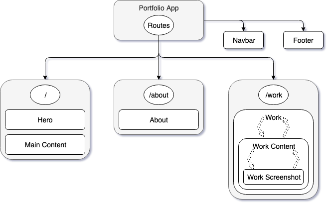

# Portfolio
_By Ben Kirby_

This is a professional portfolio primarly made with React. At this point in time it contains a main page, about page, and a work page. In the future it hopefully contains many more awards and accolades, but that bridge has yet to be crossed.

## Installation

1. Clone from `https://github.com/ben-kirby/portfolio.git`
2. In parent directory, run `$ npm install; npm run start`
3. In your browser, navigate to `localhost:8080`

## Structure

## Component List

- App
- About
  - About Image
  - About text
- Footer
  - Footer Text
- Hero
  - Hero Image
  - Hero Text
- Navbar
  - Nav Text
- Summary
  - Summary Text
    - Summary Images
- Work
  - Work Carousel
    - Work Image
    - Work Text

## Features

- Routing to all areas via navbar
- Material Icons imported
- Has a hero image on main that implements parallax on scroll
- Responsive layout
- Mobile support

## Known Issues

- No actual content at this time
- Many pages have partial/no styling

## Whats Next

- [ ] Finish styling
- [ ] Add actual content
- [ ] Deploy site
  - [ ] Get a domain

# License

_Copyright (c) 2019 Ben Kirby This software is licensed under the MIT license._